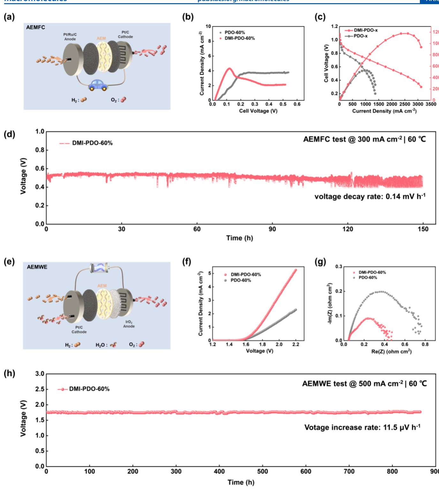

# Constructing Ordered lon Transport Channel in Anion Exchange Membranes by Coordination Induction of ${ { \mathsf { C } } { \mathsf { u } } ^ { 2 + } }$ lons

Caili Yuan, Yuhang Chen, Xiaoqin Ma, Xiaoli Lu, Wei Yuan, Jianchuan Wang\* and Zidong Wei

Cite This: Macromolecules 2025, 58, 4206-4214

# ACCESS I

l Metrics & More

# Article Recommendations

s Supporting Information

ABSTRACT: Promising anion exchange membranes (AEMs) are increasingly utilized for ion transport in various electrochemical devices operating under alkaline conditions. Achieving efficient hydroxide transport is essential for superior electrochemical performance. Herein， we propose a novel method to construct ordered ion transport channels in AEMs by coordination induction. The coordination of ${ \mathrm { C u } } ^ { 2 + }$ ions with diazafluorene induces an ordered structure of the polymer chain segments within the AEMs, thereby forming an ordered channel for fast ion transport in the membrane after the removal of ${ \mathrm { C u } } ^ { 2 + }$ ions. The fabricated AEMs exhibit ion channel size between 2.82 and 3.43 nm. Compared to the AEMs without coordination induction, the $\mathrm { O H ^ { - } }$ conductivity of the as-prepared AEMs was enhanced by aproximately4.7 times at most.Furthermore, the AEMs with ordered ion channel demonstrate impresive performance in both AEMFCs and AEMWEs, achieving a peak power density of $1 . 2 ~ \mathrm { W ~ c m } ^ { - 2 }$ and a current density of $3 . { \overset {  } { 4 } } \mathrm { A } \ \mathrm { c m } ^ { - 2 }$ ，respectively.

# INTRODUCTION

Anion exchange membranes (AEMs), composed of a polymer matrix embedded with positively charged functional groups,are primarily employed for ion transport in various fields, including anion exchange membrane fuel cells (AEMFCs) and anion exchange membrane water electrolyzers (AEMWEs).1-3 Unlike proton exchange membranes (PEMs)，AEMs offer the advantage of compatibility with nonprecious metal catalysts, leading to substantial cost reductions.4 6 The performance of AEMs is crucial for the efficiency of hydrogen energy conversion devices; yet, they face challenges such as low ionic conductivity and insufficient alkaline stability, impeding their widespread use.

In order to address these challenges and develop highperformance AEM materials，extensive research has been conducted to synthesize polymers with improved $\mathrm { O H ^ { - } }$ conductivity.Drawing inspiration from the Nafion membrane developed byDuPont, it is well-established that the construction of ion transport channels is an effective strategy for enhancing conductivity. To date，researchers have investigated various approaches for constructing these ion transport channels.For example,a Nafion membrane-like idea was used to introduce hydrophilic and hydrophobic phases into the AEM chain segments,utilizing the incompatibility of the two phases to form a microphase separation structure. The notable hydrophilicity difference between the olefinic backbone and the quaternary ammonium group renders poly(olefin)-based AEMs prone to microphase-separated structures，leading to enhanced ion transport rates and even a direct one-fold increase in $\mathrm { O H ^ { - } }$ conductivity.7 Additionally,the synergistic interaction of cations and highly hydrophobic fluorinated side chains further promotes enhanced microphase separation structures,89 resulting in the creation of ionic transport channels in poly aryl AEMs and leading to an increase in ionic conductivity from 138 to $1 6 6 ~ \mathrm { m S }$ cm-1. However， the formation of microphase-separated structures is intricately linked to the properties of the polymer chain.When the interaction between the hydrophilic and hydrophobic components of the material is weak, the formation of microphase-separated structures becomes more challenging. Consequently, researchers have increasingly explored the use of magneticfields1o-12andelectricfields3-15toinduce the polymer chain segments to organize into ordered structures, thereby facilitating the creation of well-defined ion transport channels. For example,when $\mathrm { Q A } { \cdot } \mathrm { F e } _ { 3 } \mathrm { O } _ { 4 }$ was doped into a TAPPO solution under an applied magnetic field, the directional influence of the magnetic feld led to the formation of ordered and fast ion transport channels in the QA- $\mathrm { F e } _ { 3 } \mathrm { O } _ { 4 } ,$ /TA-PPO hybrid membrane.This structural alignment resulted in a $5 5 \%$ increase in $\mathrm { O H ^ { - } }$ conductivity compared to the undoped membrane.1° In addition, through-plane (TP)-oriented AEMs were prepared using paramagnetic ferrocene polymers under a magnetic field, and a TP $\mathrm { O H ^ { - } }$ conductivity of ${ \sim } 1 6 0 \mathrm { m } S \mathrm { c m } ^ { - 1 }$ at $9 5 ~ ^ { \circ } \mathrm { C }$ was achieved.11 Furthermore,utilizing the galvanic effect to induce the formation of ion transport channels along the planar direction of the AEM can also result in a substantial increase in the ionic conductivity of the LDH-containing AEM.15 Although the unique approach of utilizing electric and magnetic felds to construct ion transport channels has significantly enhanced the performance of AEMs, it is important to note that these methods often rely on inorganic nanomaterials with magnetic and conductive properties. The dispersion issues associated with these materials during the membrane casting process can pose substantial risks to the performance of AEMs, making them less suitable for applications in electrochemical devices.Therefore, expanding the methods for constructing ion transport channels in homogeneous AEMs is likely to be more advantageous for the advancement of the AEM.

  
Figure 1. Synthetic route to PDO- $_ x$ and DMI-PDO-x.

Based on the ideal of constructing an ordered ion channel, in this work,a series of AEMs derived from poly(diazafluorenearyl-piperidine）were synthesized via a hyperacid-catalyzed polycondensation reaction,and then a coordination of ${ \mathrm { C u } } ^ { 2 + }$ ions with diazafluorene induced an ordered structure of the polymer chain segments within the AEMs. Subsequently,to prevent oxides formed by metal ions under alkaline conditions from hindering ion transport, ${ \mathrm { C u } } ^ { 2 + }$ ions are removed by acid washing, thereby forming an ordered channel for fast ion transport in the membrane. The fabricated homogeneous AEMs exhibit ion channel size between 2.82 and $3 . 4 3 ~ \mathrm { { \ n m } } ,$ ，which leads to approximately 4.7 times boosting in $\mathrm { O H ^ { - } }$ conductivity at most, compared to the AEMs without coordination induction. Furthermore,the AEM with ordered ion channel demonstrates impressive performance in both AEMFCs and AEMWEs.

# RESULTS AND DISCUSSION

Diazafluorene shares a configuration similar to that of the fluorene unit,except that two carbon atoms are replaced by nitrogen atoms.In coordination chemistry,diazafluorene is often considered a $^ { 2 , 2 ^ { \prime } }$ -bipyridine derivative with a methylene linker connecting the two pyridine rings together. Although the overlap between the nitrogen lone pair of electrons and the metal orbitals of diazafluorene is less effective than that of $^ { 2 , 2 ^ { \prime } }$ bipyridine,it is still capable of forming weak coordination bonds with many metal ions.16-19 Based on this,a series of AEMs with ordered ion transport channels derived from poly(diazafluorene-aryl-piperidine) were synthesized.In the detailed synthesis path illustrated in Figure 1，PDOT $_ x$ (where $_ x$ represents the molar ratio (in percent) of 4,S-diazafluoren-9-one to $P$ -terphenyl) was synthesized via a trifluoromethanesulfonic acid (TFSA)-catalyzed polycondensation reaction involving $p$ terphenyl, 4,S-diazafluoren-9-one,and $N$ -methyl-4-piperidon. Subsequently,PD $_ x$ membranes exhibiting disordered structures were prepared using the Menshutkin reaction of PDOT- $_ x$ with $\mathrm { C H } _ { 3 } \mathrm { I }$ . Furthermore,a series of metal-coordinated MIPDO- $_ x$ polymers with an ordered structure were successfully synthesized by utilizing the coordination properties of ${ \mathrm { C u } } ^ { 2 + }$ with the group of diazafluorene.Ultimately，the MI-PDO $_ x$ membranes underwent repeated alkaline and acid washing to produce coordination-induced DMI-PDO $_ x$ membranes with ordered ion transport channels.As shown in Table S1,the membrane thickness remained unchanged, indicating that the quality of the AEM was not affected during the acid-washing process.The photographs of various AEMs and $^ 1 \mathrm { H }$ NMR spectra of polymers are presented in Figures S1 and S2, respectively.

  
Figure 2.(a) UV/vis spectra of AEM; (b) XPS of Cu 2p spectrum in MI-PDO $6 0 \%$ ; (c) XPS of N1s spectrum in PDO. $6 0 \%$ and MI-PDO $6 0 \%$ ;(d) T-IR spectra of PDO- $6 0 \%$ and MI-PDO- $6 0 \%$ ;(e)XRDof AEM; (f) small-angle $\mathrm { X }$ -ray scattering (SAXS) patterns of PDO- $6 0 \%$ and DMI-PDO- $6 0 \%$

  
Figure 3. (a) Fullsurvey XPS spectra of MI-PDO $6 0 \%$ (b) HRTEM image of MI-PDO- $6 0 \%$ ,(c) surface and cross-sectional SEM image of MI-PDO$6 0 \%$ ; (d) full survey XPS spectra of DMI-PDO $6 0 \%$ (e)HRTEM image of DMI-PDO $6 0 \%$ ; (f) surface and cross-sectional SEM images ofDMI-PDO60.

  
Figure 4. (a) $\mathrm { O H ^ { - } }$ conductivity of AEMs at different temperatures; (b) comparison of the $\mathrm { O H ^ { - } }$ conductivity at ${ 8 0 ~ ^ { \circ } \mathrm { C } }$ and IEC of PDO $_ x$ and DMIPDO $_ x$ withrepresentativeEMsfromothreferencsandtegreenpintsrepresentdatafromthereferences,hiletevrous tsfpots indicateib;e;( and (f) TGA curves of AEMs; $\mathbf { \eta } ( \mathbf { g } )$ degradation mechanism of DMI-PDO $x _ { j }$ (h) $^ \mathrm { { \Delta _ { 1 } } } \mathrm { { \Delta _ { H } ^ { \mathrm { { \Delta } } } } }$ NMR spectrum of DMI-PDO $_ x$ after immersion in $1 ~ \mathrm { m o l ~ L ^ { - 1 } }$ $\mathrm { \Delta N a O H }$ for $2 5 0 0 \mathrm { h }$ at $8 0 ~ ^ { \circ } C ;$ (i) $\bar { \mathrm { O H } ^ { - } }$ conductivity decay of DM-PDO $_ x$ in $\mathrm { 1 \ m o l { L } ^ { - 1 } \mathrm { N a O H } }$ for $2 5 0 0 \mathrm { h }$ at $8 0 ~ ^ { \circ } \mathrm { C } ;$ (j)mechanical properties of DMIPDO- $_ x$ after immersed in $\mathrm { 1 \ m o l \ L ^ { - 1 } N a O H }$ for $2 5 0 0 \mathrm { h }$ at $8 0 ~ ^ { \circ } \mathrm { C }$

Figure 2a and Figure S3 demonstrate a comparison of the UV/vis absorption spectra of AEMs before and after coordination with ${ \mathrm { C u } } ^ { 2 + }$ . It was evident that the UV absorption peaks of AEMs exhibited a blue shift following coordination, with the extent of the blue shift increasing progressively with the number of ligands，primarily attributed to the Cu d-d transition. $2 0 { - } 2 2$ The $\mathrm { { C u } }$ and N valence and bonding states in the AEM were analyzed using XPS.As shown in Figure 2b and Figure $\mathtt { S 4 a } _ { \mathtt { i } }$ the $\mathrm { C u } 2 \mathrm { p }$ XPS peaks at 932.3 and $9 5 2 . 7 \ \mathrm { e V } $ along with the characteristic satelite peaks, confirmed the presence of ${ \mathrm { C u } } ^ { 2 + }$ ions in the MI-PDO $_ x$ membrane. Figure 2c and Figure S5 displays the N 1s XPS spectra of PDO $_ x$ and MI-PDO- $x$ with a new peak at $4 0 2 . 8 8 ~ \mathrm { e V }$ in the MI-PDO- $_ x$ membrane, indicating the formation of the $\mathrm { C u - N }$ bond.2324itall vibration peaks attributed to $\mathrm { C u - N }$ at $6 3 6 ~ \mathrm { c m ^ { - 1 } }$ also were observed in_the FT-IR spectra of MI-PDO $_ x$ (Figure 2d and Figure S6),25 further confirming that ${ \mathrm { C u } } ^ { 2 + }$ ions had successfully formed coordinate bonds with N.Moreover, ${ \mathrm { C u } } ^ { 2 + }$ in AEM readily reacted with $\mathrm { O H ^ { - } }$ under alkaline conditions, leading to the leaching of ${ \mathrm { C u } } ^ { 2 + }$ $\left( \operatorname { C u } ( \operatorname { O H } ) _ { 2 } \right)$ ，followed by possible decomposing to $\mathrm { { c u O } }$ under high temperature (black particles observed).To remove the possible formed ${ \mathrm { C u } } ( { \mathrm { O H } } ) _ { 2 }$ and $\mathrm { { c u O } }$ from MI-PDO- $x _ { i }$ repeated acid washing was adopted to obtain DMI-PDO- $_ x$ 、The final membrane DMI-PDO- $_ x$ was characterized by $\mathrm { C u } 2 \mathrm { p }$ XPS and XRD.The results are shown in Figure S4b and Figure 2e,where no Cu-related peaks were observed, which,together with the ICP-Cu in Table S2,confirmed that the ${ \mathrm { C u } } ^ { 2 + }$ ion had been completely removed.

To investigate the effect of coordination induction on the microstructural morphology of AEMs，SAXS profiles were analyzed, as illustrated in Figure 2f and Figure S7. Compared to PDO- $x _ { i }$ ，DMI-PDO $_ x$ exhibited a distinct scattering peak corresponding to a $d$ -spacing of $2 . 8 2 \substack { - 3 . 4 3 \ \mathrm { n m } }$ ,indicating that coordination induction facilitated the formation of a welldefined ion transport channel within the AEM. This result was consistent with that observed by TEM.First,under the influence of coordination with ${ \mathrm { C u } } ^ { 2 + }$ ions, a $\mathrm { C u } ~ 2 \mathrm { p }$ peak appeared in the XPS total spectrum of MI-PDO- $_ x$ (Figure 3a and Figure S8), while a weak metal lattice streak was also shown in MI-PDO$6 0 \%$ (Figure 3b),but these did not affect the dense structure of the AEM (Figure 3c). Subsequently, the peak corresponding to Cu was absent in the XPS total spectrum (Figure 3d) following the removal of ${ \mathrm { C u } } ^ { 2 + }$ ions, further confirming that DMI-PDO- $_ x$ had been thoroughly washed.Figure 3e shows the TEM image of DMI-PDO- $6 0 \%$ ,with the bright areas representing hydrophobic structural domains and the dark areas representing hydrophilic structural domains,where well-connected and ordered iontransport channels were observed (yellow curve).Combined with the separation of hydrophobic and hydrophilic phase domains observed in the AFM phase images (Figure S9), these findings indicate that constructing ion transport channels through coordination induction is an effective approach.Finally, to investigate the effect of washing on the compactness of the AEM, SEM was conducted on both the surface and the crosssection of the AEM,with results presented in Figure 3f and Figures S1O and S11.The observations revealed that the surface of the AEM was flat,while the cross section was dense and nonporous，which was advantageous for its application in electrochemical scenarios.

Membrane Properties.The ionic conductivity of AEMs is a crucial factor influencing the performance of AEMFCs and AEMWEs.To investigate the impact of coordination induction on ionic conductivity，the $\mathrm { O H ^ { - } }$ conductivity of AEMs was measured before and after coordination induction at various temperatures.As shown in Figure 4a，similar to that of traditional AEMs, the $\mathrm { O H ^ { - } }$ conductivity of AEMs exhibited a positive correlation with temperature.The $\mathrm { O H ^ { - } }$ conductivity of each series of AEMs showed a strong dependence on the IEC, with PDO- $4 0 \%$ and DMI-PDO- $4 0 \%$ ，which possessed the highest IEC $\left( 1 . 9 0 \mathrm { m m o l } \mathrm { g } ^ { - 1 } \right.$ ,Table S3),demonstrating optimal $\mathrm { O H ^ { - } }$ conductivity in the PDO $_ x$ and DMI-PDO- $_ x$ series, respectively. Notably，a significant enhancement in the conductivity of AEMs was observed after coordination induction. Specifically,DMI-PDO $4 0 \%$ ，DMI-PDO- $6 0 \%$ ，and DMI-PDO- $8 0 \%$ exhibited $\mathrm { O H ^ { - } }$ conductivities of 90,84,and 27 $\mathrm { m } S ~ \mathrm { c m } ^ { - 1 }$ at $2 5 ~ ^ { \circ } \mathrm { C }$ ，respectively. In contrast， the $\mathrm { O H ^ { - } }$ conductivities of PDO- $4 0 \%$ ，PDO $6 0 \%$ ，and $\mathrm { P D O } { - } 8 0 \%$ were only 57,27,and $5 \mathrm { m } S \mathrm { c m } ^ { - 1 }$ at $2 5 ^ { \circ } C ,$ respectively.This variation in the $\mathrm { O H ^ { - } }$ conductivity was primarily attributed to the coordination induction that facilitated the formationof ordered ion transport channels.Moreover, the degree of conductivity enhancement in DMI-PDO- $_ x$ varied with the content of 4,5- diazafluoren-9-one,with DMI-PDO- $8 0 \%$ showing the most significant enhancement—4.7 times than that of PDO- $8 0 \%$ (Figure 4b). This was because 4,5-diazafluoren-9-one was the ligand and played a decisive role in the formation of ordered ion transport channels.Under the influence of the ordered ion channels formed by coordination induction, the AEM prepared in this work possessed a superior conductivity than the AEM in the literature at low IEC (Table S4).3,56,8,9,26,27

Although high water uptake is generally beneficial for high $\mathrm { O H ^ { - } }$ conductivity，excessive water uptake can lead to over membrane swelling and eventual fragmentation of the AEM. Therefore, it is desirable to develop AEMs with excellent $\mathrm { O H ^ { - } }$ conductivity without excessive water uptake.In this study, the water uptakes and swelling ratios of DMI-PDO $_ x$ and PDO- $_ x$ were compared,as depicted in Figure 4c,d. Unsurprisingly, for both PDO- $X$ and DMI-PDO- $\boldsymbol { x }$ ,the water uptake and swelling ratio showed an increasing trend with increasing IEC. Additionallyollowinghal ${ \mathrm { C u } } ^ { 2 + }$ ，"microvacancies" form in DMI-PDO- $x$ ,leading to an increase in free volume that facilitates the ingress of water molecules into the AEM,resulting in theWU of DMI-PDO $_ x$ being slightly higher than that of PDO- $_ x$ However, the swelling ratio was slightly lower than that of PDO- $x _ { i }$ ，which may be due to the coordination interactions enhancing the ordered stacking of the polymer segments.This compact AEM structure, to some extent, hinders the swelling of the AEM.However, it was noteworthy that the AEM exhibited less than a $10 \%$ swelling ratio in the 28 and $7 1 \%$ water uptake intervals，which was highly beneficial for maintaining the mechanical properties of fully hydrated AEMs.

The mechanical properties of the AEMs are shown in Figure 4e.It was evident that the overall tensile stress of the AEMs decreased while the strain increased, following coordination induction. This trend was closely related to the WU of the membranes, as water generally acted as a plasticizer, enhancing the toughness of the AEM.Furthermore, it was noteworthy that the tensile stresses of all AEMs exceed $2 0 \ \mathrm { M P a }$ ，which was attributed to the benefits of the all-aromatic structure of the AEM.The thermal decomposition temperature of the AEMs was evaluated using TGA under a $\Nu _ { 2 }$ atmosphere (Figure 4f).As can be seen, the decomposition of the AEMs occurred in three distinct steps.The weight loss in the first step,occurring before $1 0 0 ~ ^ { \circ } \mathrm { C } ,$ ，most probably corresponded to the evaporation of water. Subsequently, the second step of weight loss,observed around $2 0 0 ^ { \circ } \mathrm { C }$ ,was indicative of the degradation and loss of the piperidine cation. Finally，the backbone of the AEM decomposed at approximately $4 0 0 ^ { \circ } \mathrm { C } .$ The high decomposition temperature of the AEM suggested that the AEMs were suitable forboth AEMFCand AEMWE.

To assess the alkaline stability of the AEMs,DMI-PDO $_ x$ and PDO- $_ x$ were immersed in a $\mathrm { 1 \dot { m } o l \ L ^ { - 1 } N a O H }$ aqueous solution at $8 0 ~ ^ { \circ } \mathrm { C }$ for ex situ testing. After $2 5 0 0 \mathrm { h }$ of testing, the membrane remained intact, showing no visible cracks or holes.However, SAXS measurements indicated a slight reduction in the size of the ion channels in DMI-PDO- $4 0 \%$ and DMI-PDO- $60 \%$ (Figure S12)，which may be attributed to excessive water absorption disrupting the segmental order.In contrast, the ion channel size in DMI-PDO- $8 0 \%$ ，which exhibited low water absorption，showed almost no change.Additionally，the piperidine ring,as a potential degradation pathway for anion exchange membranes (AEMs),is also susceptible to $\mathrm { O H ^ { - } }$ attack (Figure $^ { 4 } \mathrm { g }$ and Figure Sl3a). To investigate the potential degradation reactions, the $^ 1 \mathrm { H }$ NMR spectra of the AEMs were analyzed after exposure to alkali resistance,and the results were shown in Figure $^ \mathrm { 4 h }$ and Figure S13b. Not surprisingly， new peaks attributed to $\mathrm { C } { = } \mathrm { C }$ protons appeared at chemical shifts of 6.52 (at position b)，5.26 (at position a)，and $4 . 8 4 ~ \mathrm { p p m }$ (at position $\mathsf { a } ^ { \prime }$ ）compared to the $\mathrm { \bar { ^ { 1 } H } }$ NMR spectra before alkali resistance. Based on this result, a corresponding decrease in conductivity was observed for both DMI-PDO- $_ x$ and PDO- $_ x$ Specifically,among the DMI-PDO $_ x$ series (Figure 4i),DMIPDO- $8 0 \%$ exhibited the highest degradation of $9 . 2 4 \%$ ,while the degradation for DMI-PDO $4 0 \%$ and DMI-PDO- $6 0 \%$ were $1 . 4 4 \%$ and $8 . 4 6 \%$ ,respectively.This was primarily because the maximum water uptake of DMI-PDO- $4 0 \%$ effectively diluted the $\mathrm { O H ^ { - } }$ concentration around the piperidine ring, thereby reducingthenucleophilicityandbsicityof $\mathrm { O H ^ { - } }$ 28.,29 Similarly, the degradation of PDO- $_ x$ followed a comparable trend to DMIPDO- $_ x$ (Figure S13c)，with PDO $8 0 \%$ showing the highest degradation at $1 6 . 7 7 \%$ ，followed by PDO $6 0 \%$ $( 1 1 . 7 4 \% )$ and PDO- $40 \%$ $\left( 4 . 4 7 \% \right)$ .However,all of these data were significantly higher than those of the DMI-PDO- $_ x$ series.This was attributed to the ordered structure in DMI-PDO- $\cdot x ,$ which promoted the formation of ionic clusters,leading to the accumulation of water and a reduction in $\mathrm { O H ^ { - } }$ concentration around the functional groups. Figure 4j and Figure S13d depict the mechanical properties of the AEMs after $2 5 0 0 \ \mathrm { h }$ ina $\mathrm { 1 ~ m o l ~ L ^ { - 1 } \ N a O H }$ solution.At lower levels of water uptake,AEMs tended to exhibit increased brittleness but were still able to maintain mechanical properties in excess of $5 \ \mathrm { M P a }$ ：

  
Figure 5.(a) Schematic of AEMFC cell; (b) LSV of MEAs based on PDO $_ x$ and DMI-PDO- $6 0 \%$ ,testing conditions: $1 0 0 \% / 1 0 0 \%$ A/C RH, $8 0 ^ { \circ } C , 1$ $\mathrm { m } \bar { \mathrm { V } } \ s ^ { - 1 }$ and free-backpressure; (c) AEMFC performance based on PDO $6 0 \%$ and DMI-PDO- $6 0 \%$ t ${ \bar { 8 } } 0 \ { } ^ { \circ } \mathrm { C } ;$ (d) in situ durability performance of AEMFC with DMI-PDO $6 0 \%$ -based MEA at $6 0 ^ { \circ } \mathrm { C }$ under a current density of $3 0 0 \mathrm { m A c m } ^ { - 2 }$ and without backpressure; (e) schematic of AEMWE cell; (f) polarization curves at the temperature of $8 0 ~ ^ { \circ } \mathrm { C } .$ Catalyst loadings were $2 . 0 \mathrm { m g } \mathrm { I r O } _ { 2 } \mathrm { c m } ^ { - 2 }$ at the anode and $1 \mathrm { m g } \mathrm { P t } \mathrm { c m } ^ { - 2 }$ at the cathode; $( \mathbf { g } )$ Nyquist plots at the operating temperature of $8 0 ~ ^ { \circ } \mathrm { C } ;$ (h) long-term stability performance of AEMWE at $5 0 0 \mathrm { m A } \mathrm { c m } ^ { - 2 }$ and ${ 6 0 ~ ^ { \circ } \mathrm { C } }$ in $1 ~ \mathrm { m o l ~ L ^ { - 1 } }$ $\mathrm { { o l } \mathrm { { L } ^ { - 1 } \tilde { N a O H } } }$

The fuel cell performances with different AEMs were evaluated at $8 0 ~ ^ { \circ } \mathrm { C }$ with $1 0 0 \%$ relative humidity at both the anode and cathode sides using $_ { \mathrm { H } _ { 2 } - \mathrm { O } _ { 2 } }$ (Figure Sa). It is seen in Figure Sb that the hydrogen permeation current of DMI-PDO$6 0 \%$ was lower than that of PDO- $60 \%$ .This indicated that the AEM maintained good gas tightness even after ${ \mathrm { C u } } ^ { 2 + }$ ion removal.Figure S14 demonstrates the trend of ${ \mathrm { H } } _ { 2 } { - } \mathrm { O } _ { 2 }$ fuel cell power density with increasing backpressure for DMI-PDO $6 0 \%$ based-MEA.Consistent with other fuel cells,increasing the backpressure proved to be beneficial. Specifically, the peak power density increased from 0.7 to 1.1 W $\mathrm { c m } ^ { - 2 }$ as the backpressure was increased from O to $0 . 1 \mathrm { M P a }$ . The maximum peak power density of $1 . 2 ~ \mathrm { W ~ c m } ^ { - 2 }$ was achieved at $0 . 4 5 \mathrm { V }$ at a backpressure of $0 . 2 \mathrm { M P a }$ .In contrast, the PDO- $6 0 \%$ based-AEM fuel cell reached only a peak power density of $0 . 5 3 W \mathrm { c m } ^ { - 2 }$ at 80 $^ \circ \mathrm { C }$ and $0 . 2 \mathrm { M P a }$ backpressure (Figure Sc), which was only $4 4 \%$ of thatachieved by the DMI-PDO- $6 0 \%$ .Finally, the DMI-PDO$6 0 \%$ AEM-based fuel cell was further subjected to in situ durability testing at a constant current density of $0 . 3 \mathrm { A c m } ^ { - 2 }$ at $6 0 \ ^ { \circ } \mathrm { C } ,$ and the results were shown in Figure Sd. The voltage decay rate of the DMI-PDO- $6 0 \%$ -based MEAwas $0 . 1 4 ~ \mathrm { m V h } ^ { - 1 }$ after $1 5 0 \mathrm { h }$

In addition to AEMFC, the AEMWE performance of the DMI-PDO- $60 \%$ and PDO- $6 0 \%$ membranes was evaluated. The $i - V$ curves at different temperatures were measured in $1 \mathrm { m o l L } ^ { - 1 }$ NaOHusing $2 \mathrm { m g } \mathrm { c m } ^ { - 2 } \mathrm { I r } \mathrm { \hat { O } } _ { 2 }$ and $1 \mathrm { m g } \mathrm { c m } ^ { - 2 } \mathrm { P t } / \mathrm { C }$ as the anode and cathode catalysts, respectively (Figure Se).The MEA was assembled by using a conventional catalyst-coated substrate (CCS） method.At the operating temperature of $8 0 ~ ^ { \circ } \mathrm { C } ,$ the current density of the DMI-PDO- $6 0 \%$ -basedcell at $2 . 0 \mathrm { V }$ was 3.4 $\mathbf { A \ c m } ^ { - 2 }$ ，while the PDO- $6 0 \%$ -based cell was only $1 . 5 \mathrm { ~ A ~ c m } ^ { - 2 }$ (Figure Sf). The lower performance of the PDO $6 0 \%$ -based cell may be due to the poor $\mathrm { O H ^ { - } }$ transfer efficiency of PDO $6 0 \%$ relative to DMI-PDO- $6 0 \%$ ,which was evidenced by the lower ohmic resistance (Rohm）of DMI-PDO- $6 0 \%$ -based MEA relative to that of PDO- $6 0 \%$ -based MEA (Figure ${ \mathfrak { s g } } ,$ ).Finally, the PDO- $6 0 \%$ -based MEA and DMI-PDO $6 0 \%$ -based MEA were tested for electrolytic water stability,respectively,and the resultsare shown in Figure Sh.The voltage increase rate of the DMI-PDO- $60 \%$ -based MEA was $1 1 . 5 \mu \mathrm { { \bar { V } } h ^ { - 1 } }$ after continuous electrolysis for $8 6 4 \mathrm { h }$ at a current density of $5 0 0 \mathrm { m A } \mathrm { c m } ^ { - 2 }$ in a 1 mol $\mathrm { L } ^ { \mathrm { - i } } \mathrm { N a O H }$ solution at $6 0 ~ ^ { \circ } \mathrm { C }$

# CONCLUSIONS

In summary, this study employed a novel method to construct ordered ion transport channels by coordination induction within the AEMof DMI-PDO $_ { x , }$ .The coordination of ${ \mathrm { C u } } ^ { 2 + }$ ions with diazafluorene induced an ordered structure of the polymer chain segments within the AEMs,thereby forming an ordered channel for fast ion transport in the membrane after the removal of ${ \mathrm { C u } } ^ { 2 + }$ ions.The fabricated AEMs exhibited ion channel size between 2.82 and $3 . 4 3 \mathrm { n m }$ ,which improved the ion transfer properties of the DMI-PDO- $_ x$ membrane.Consequently, the DMI-PDO $_ x$ membrane achieved $\mathrm { O H ^ { - } }$ conductivities that were 4.7 times greater than those of the PDO $_ x$ membrane,which did not utilize coordination induction.Furthermore, the DMI-PDO $_ x$ membrane maintained over $9 8 \%$ of its $\mathrm { O H ^ { - } }$ conductivityafter $2 5 0 0 \mathrm { h }$ in $\mathrm { 1 \ m o l { L } ^ { - 1 } \ N a O H }$ solution at $8 0 ~ ^ { \circ } \mathrm { C }$ Additionally, the DMI-PDO- $6 0 \%$ -based MEA reached a peak power density of $1 . 2 \mathrm { W } \mathrm { c m } ^ { - 2 }$ in an AEMFC,and it had a voltage decay rate of only $0 . 1 4 ~ \mathrm { m V ~ h ^ { - 1 } }$ after $1 5 0 \ \mathrm { h }$ at a current density of $3 0 0 \mathrm { \ m A } \mathrm { \ c m } ^ { - 2 }$ The DMI-PDO- $6 0 \%$ -based MEA also demonstrated superior performance compared with the PDO- $6 0 \%$ -basedMEAin an AEMWE,achieving a current density of 3.4A $\mathrm { c m } ^ { - 2 }$ at $2 \textrm { V }$ Moreover,it exhibited a voltage decay rate of only $1 1 . 5 \mu \mathrm { V h } ^ { - 1 }$ over 864 h of continuous electrolytic operation at a current density of $5 0 0 \mathrm { m A c m } ^ { - 2 }$ at $6 0 ^ { \circ } \mathrm { C }$ in a $\mathrm { 1 m o l L ^ { - 1 } N a O H }$ solution.

# ASSOCIATED CONTENT

# $\bullet$ Supporting Information

The Supporting Information is available free of charge at https://pubs.acs.org/doi/10.1021/acs.macromol.5c00353.

Materials and measurements； syntheses of polymer precursors；photographs of AEM; $^ 1 \mathrm { H }$ NMR spectra polymers；UV/vis spectrum，XPS spectrum，TF-IR spectrum， small-angle X-ray scattering patterns， SEM images of AEM; IEC,WU, SR, $\mathrm { O H ^ { - } }$ conductivity, stress and strain of AEMs; degradation mechanism of PDO- $_ x$ AEMFC performance based on DMI-PDO $6 0 \%$ ；and comparisons of AEM in this work and reference data (PDF)

# AUTHOR INFORMATION

Corresponding Authors Jianchuan Wang- School of Chemistry and Chemical Engineering,State KeyLaboratory ofAdvanced Chemical Power Sources, Chongqing University， Chongqing 400044, China; $\circledcirc$ orcid.org/0000-0002-4632-9413; Email: jxw319@cqu.edu.cn Zidong Wei- School of Chemistry and Chemical Engineering, State Key Laboratory of Advanced Chemical Power Sources, Chongqing University, Chongqing 400044, China; ① orcid.0rg/0000-0001-8001-9729; Email: zdwei@ cqu.edu.cn

Authors Caili Yuan - School of Chemistry and Chemical Engineering, State Key Laboratory of Advanced Chemical Power Sources, Chongqing University， Chongqing 400044, China Yuhang Chen-School of Chemistry and Chemical Engineering, State Key Laboratory of Advanced Chemical Power Sources, Chongqing University, Chongqing 400044, China

Xiaoqin Ma- School of Chemistry and Chemical Engineering, State Key Laboratory of Advanced Chemical Power Sources, Chongqing University， Chongqing 400044, China XiaoliLu- School of Chemistry and Chemical Engineering, State Key Laboratory of Advanced Chemical Power Sources, Chongqing University, Chongqing 40o044, China Wei Yuan - School of Chemistry and Chemical Engineering, State Key Laboratory of Advanced Chemical Power Sources, Chongqing University, Chongqing 400044, China

Complete contact information is available at: https://pubs.acs.org/10.1021/acs.macromol.5c00353

# Author Contributions

The manuscript was written through contributions of al authors.All authors have given approval to the final version of the manuscript.

# Notes

The authors declare no competing financial interest.

# ACKNOWLEDGMENTS

The authors would like to express great thanks to the financial support of the National Key Research and Development Program of China (2021YFB4001200)and the Natural Science Foundation of China (grant no.22478044).

# REFERENCES

(1) Zheng,W.; He,L.; Tang,T.; Rong,R.; Lee,H.; Ding, G.; Wang,L.; Sun,L.Poly(Dibenzothiophene-Terphenyl Piperidinium） for Highperformance Anion Exchange Membrane Water Electrolysis. Angew. Chem.,Int.Ed.2024,136 (34),No.e202405738.   
(2) Wan,L.; Liu,J;Lin,D.; Xu,Z.; Zhen,Y.;Pang,;Xu $\mathrm { Q . } ;$ Wang, B.3D-ordered catalytic nanoarrays interlocked on anion exchange membranes for water electrolysis. Energy Environ. Sci. 2024,17(10), 3396-3408.   
(3) Kim,S.; Yang,S.H.; Shin,S.-H.; Cho,H.J.;Jang,J. K; Kim,T.H; Oh, S.-G.； Kim, T.-H.； Han,H.； Lee, J.Y.High-performance and durable anion-exchange membrane water electrolysers with highmolecular-weight polycarbazole-based anion-conducting polymer. Energy Environ. Sci.2024,17 (15),5399-5409.   
(4) Du, W.; Liu,L.; Yin,L.; Li,B.; Ma,Y.; Guo,X.; Zang,H.Y.; Zhang, N.； Zhu, G.Ultrathin Free-Standing Porous Aromatic Framework Membranes forEficient Anion Transport.Angew. Chem., Int.Ed.2024, 63 (22),No. e202402943.   
(5) Zeng,M.; He,X.; Wen,J.; Zhang, G.; Zhang, H.; Feng,H.; Qian, Y.; Li,M.N-Methylquinuclidinium-Based Anion Exchange Membrane with Ultrahigh Alkaline Stability.Adv.Mater.2023，35 (51), No. 2306675.   
(6) Wang,J.; Zhao,Y.; Setzler,B.P.; Rojas-Carbonel,S.; Ben Yehuda, C.; Amel,A.; Page,M.; Wang,L.; Hu,K.; Shi,L.; Gottesfeld, S.; Xu,B.; Yan，Y.Poly(aryl piperidinium）membranes and ionomers for hydroxide exchange membrane fuel cells.Nat. Energy 2019,4(5), 392-398.   
(7) Zhu,L.; Yu,X.; Peng,X.; Zimudzi,T.J.; Saikia,N.; Kwasny,.T.; Song,S.; Kushner,D.L; Fu,Z.; Tew, G.N.; Mustain,W.E.; Yandrasits, M.A.; Hickner,M.A.Poly(olefin)-Based Anion Exchange Membranes Prepared Using Ziegler-Natta Polymerization. Macromolecules 2019, 52 (11),4030-4041.   
(8) Xu, G.; Pan,J.; Zou,X.;Jin,Z.; Zhang,J.; Fang,P.;Zhang,Q; Sun, Z.；Yan，F.High-performance Poly(biphenyl piperidinium） Type Anion Exchange Membranes with Interconnected Ion Transfer Channels: Cooperativity of Dual Cations and Fluorinated Side Chains. Adv.Funct.Mater.2023,33 (35),No.2302364.   
(9)Wu, X.; Chen, N.; Hu, C.； Klok, H. A.； Lee,Y. M.；Hu, X. Fluorinated Poly(Aryl Piperidinium) Membranes for Anion Exchange Membrane Fuel Cells.Adv.Mater.2023,35 (26),No.e2210432. Magnetic field-oriented ferroferric oxide/poly(2,6-dimethyl-1,4-phenylene oxide） hybrid membranes for anion exchange membrane applications. Nanoscale 2018,10 (39),18680-18689.   
(11) Liu,X.; Xie,N.; Xue,J.; Li,M.; Zheng, C.; Zhang,J.; Qin, Y.; Yin, Y.; Dekel,D.R.; Guiver, M.D.Magnetic-field-oriented mixed-valencestabilized ferrocenium anion-exchange membranes for fuel cels. Nat. Energy 2022,7 (4),329-339.   
(12) Yang,H.; Ma,X.; Ma,W.; Shi,M.; Zhang,J.; Jiang,Y.;Cao, Z.; GongF;PanJgeticasistedeedsortangeion channels tofacilitate ion conductivity for alkalineanion exchange membrane fuel cell. J. Membr. Sci. 2025,717,No.123600.   
(13)Kim,J.-H.; Ryu, S.; Lee,J.-Y.; Moon, S.-H.Preparationof highconductivity QPPO (quaternary-aminated poly (2,6-dimethyl-1,4- phenyleneoxide)） membranes by electrical treatment. J.Membr. Sci. 2018, 553,82-89.   
(14) Zhu，H.； Li,R； Chen,N.； Wang, F.；Wang, Z.； Han,K. Electrorheological effect induced quaternized poly(2,6-dimethyl phenylene oxide)-layered double hydroxide composite membranes for anion exchange membrane fuel cells.RSC Adv. 2016,6 (88), 85486-85494.   
(15）Fan,J.；Zhu,H.;Li,R； Chen, N.； Han,K. Layered double hydroxide-polyphosphazene-based ionomer hybrid membranes with electric field-aligned domains for hydroxide transport. Journalof Materials Chemistry A 2014,2 (22),8376.   
(16）Annibale,V. T.； Song， D. Coordination chemistry and applications of versatile4,5-diazafluorene derivatives.Dalton Transactions 2016,45 (1),32-49.   
(17)Wong, K.-T.; Chen, H.-F.; Fang, F.-C.Novel Spiro-Configured PET Chromophores Incorporating 4,5-Diazafluorene Moiety as an Electron Acceptor. Org. Lett. 2006,8 (16),3501-3504.   
(18)Li W-J;LuBQianY;Xie,L-H;WangJ;LBHag W.Synthesis and characterizationof diazafluorene-based oligofluorenes and polyfluorene.Polym. Chem. 2013,4 (6),1796.   
(19)Baysal,A.；Connor,J.A;Walis,J.D.Complexesof4,5- Diazafluorene and $^ { 9 , 9 ^ { \prime } }$ -Bis(4,5-Diazafluorenyl)withNickel(i), Copper(Ii) and Zinc(Ii). J. Coord. Chem. 2001, S3 (4),347-354. (20) Krockert,K.W; Garg,F.;Heck,J; Heinz,M.V.; Lange,J; Schmidt，R.；Hoffmann，A.；Herres-Pawlis,S.ATRP catalysts of tetradentate guanidine ligands- do guanidine donors induce a faster atom transfer?Dalton Transactions 2024,53(7),2973-2990.   
(21）Li,Y.； Fan， W.； Zhang, Z.； Xie, X.； Xiang, S.； Huang, D. Copper(ii)-hydroxide facilitated C-C bond formation: the carboxamido pyridine system versus the methylimino pyridine system. Dalton Transactions 2020,49 (35),12189-12196.   
(22) Kirin,S.I.; Dübon,P.; Weyhermüller,T.; Bill,E.; Metzler-Nolte, N. Amino Acid and Peptide Bioconjugates of Copper(II) and Zinc(II) Complexes withaodified NN-Bis(2-picoll)amineLigand.Inorg Chem. 2005,44 (15),5405-5415.   
(23) Wu,M.; Zhang,X; Zhao,Y.; Yang,C.;Jing,S.; Wu, $\mathrm { Q . } ;$ Brozena, A; Miller,J.T.; Libreto,N.J.;Wu,T.;BhattacharyyaS.; Garaga. N.; Zhang,Y.; QiY.; Greenbaum,S.G.; Briber,RM.; Yan,Y.; HuLA high-performance hydroxide exchange membrane enabled by $\mathbf { C u } 2 + \cdot$ crosslinked chitosan.Nat. Nanotechnol 2022,17 (6),629-636.   
(24) Zhao,X.; Chen,J.; Mao,X.; Li, C.; He,L.; Zhang,F.; Zhang, M.; Diwu, J; Wu, G.; Chai,Z.;Wang, S.One-Pot Synthesis ofa MixedValent Copper(I/I1)-Coordinated Covalent Organic Framework Induced by $\gamma .$ Ray Radiation.Inorg. Chem. 2024, 63 (26)，12333- 12341.   
(25)Gashu,M.; Aragaw,B.A.; Tefera,M.;Abebe,A.Poly(bis $^ { ( 2 , 2 ^ { \prime } }$ bipyridine) hydroxy Copper(II) iodide modified glassy carbon electrode for electrochemical determination of chloroquine in pharmaceuticals and biological samples. Sensing and Bio-Sensing Research 2023,42,No.100598.   
(26)Hu,C.; Park,J. H.; Kang,N.Y.; ZhangX.; Lee,Y.J.;Jeong, S.W.; Lee,Y.M.Effects ofhydrophobic side chains inpoly(fluorenyl-co-aryl piperidinium） ionomers for durable anion exchange membrane fuel cells.I. Mater.Chem.A 2023.11 (4).2.031-2.041 (27)Allushi, A.; Bakvand,P.M.; Janasch,P.PolyfluorenesBearig N,N-Dimethylpiperidinium Cations on Short Spacers for Durable Anion Exchange Membranes.Macromolecules 2023,S6 (3),1165- 1176.   
(28)Willdorf-Cohen,S.; Zhegur-Khais,A.; Ponce-Gonzalez,J.; BsoulHaj,S.; Varcoe,J.R.; Diesendruck, C.E.; Dekel,D.R.Alkaline Stability of Anion-Exchange Membranes.ACS Applied Energy Materials 2023,6 (2),1085-1092.   
(29)Muller,J.; Zhegur,A.; Krewer,U.; Varcoe,J.R.;Dekel,D.R. Practical ex-Situ Technique To Measure the Chemical Stability of Anion-Exchange Membranes under Conditions Simulating the Fuel Cell Environment.ACS Mater.Lett.2020,2 (2),168-173.